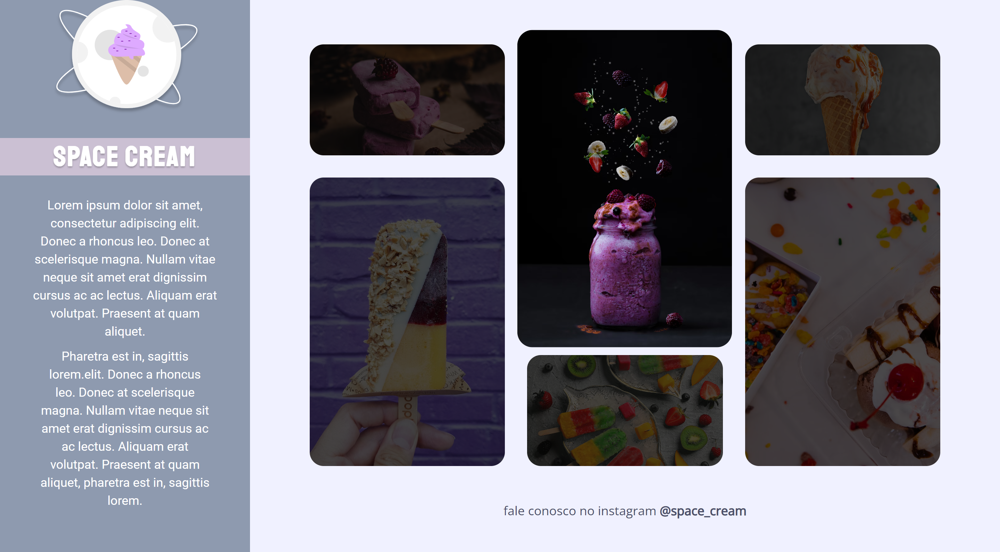
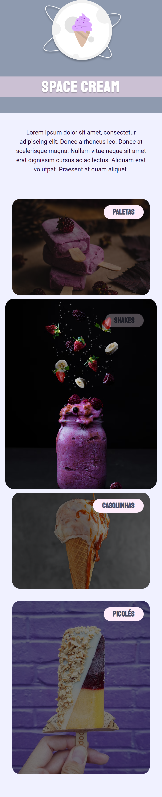
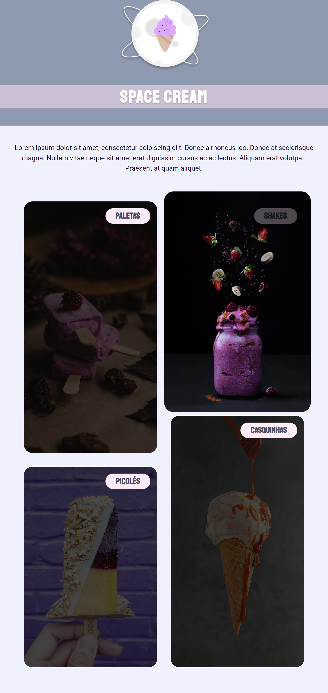

<h1 align="center">
Space Cream
</h1>

## Indexes

- [About](#about)
- [Built in](#built_in)
- [Go to](#go_to)
- [Preview](#preview)

 

## About 

This challenge was done in the 3rd module of Explorer Stage 3 - Rocketseat.

In this challenge, knowledge of css grid, media queries, animations, transitions, responsiveness, filters, css variables and scrollbar manipulation is put into practice.

 

## Built in 

- HTML
- CSS

 

## Go to 

To access the site is simple, just click on the <a href = "https://space-cream-swart.vercel.app">link</a>

 

## Preview 

   

### PC

  
  

### Mobile

  
  

### Tablet

  

